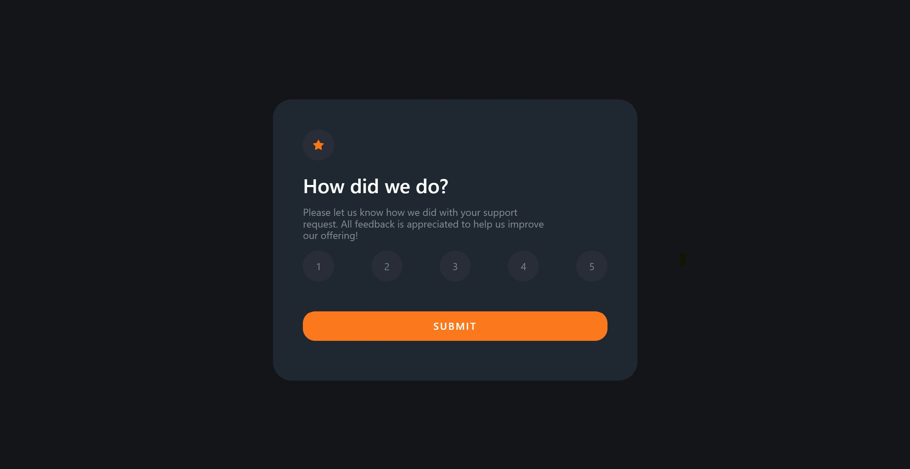

# Frontend Mentor - Interactive rating component solution

I know that this is the most simple project ever but it was the very first one I made and I leave it here to remind myself how far I've come.

This is a solution to the [Interactive rating component challenge on Frontend Mentor](https://www.frontendmentor.io/challenges/interactive-rating-component-koxpeBUmI).

## Table of contents

-   [Overview](#overview)
    -   [The challenge](#the-challenge)
    -   [Screenshot](#screenshot)
    -   [Links](#links)
-   [My process](#my-process)
    -   [Built with](#built-with)
    -   [What I learned](#what-i-learned)
    -   [Continued development](#continued-development)
-   [Author](#author)

**Note: Delete this note and update the table of contents based on what sections you keep.**

## Overview

### The challenge

Users should be able to:

-   View the optimal layout for the app depending on their device's screen size
-   See hover states for all interactive elements on the page
-   Select and submit a number rating
-   See the "Thank you" card state after submitting a rating

### Screenshot

### Links

-   Solution URL: [https://cool-frangollo-7f93a2.netlify.app/](https://cool-frangollo-7f93a2.netlify.app/)

## My process

### Built with

-   Semantic HTML5 markup
-   CSS custom properties
-   Flexbox

### What I learned

This was my very first attempt at building someone on my own, so even though it's very simple, it was my first project.

### Continued development

In the future I want to focus more on mobile first design as I learned the pitfalls of ignoring this philosophy.

## Author

-   Website - [https://www.coolesthandluke.com](https://www.coolesthandluke.com)
-   Frontend Mentor - [https://www.frontendmentor.io/profile/coolesthandluke](https://www.frontendmentor.io/profile/coolesthandluke)
